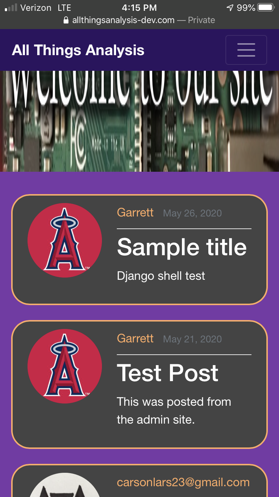

# All-Things-Analysis
A Static Blog Written in Python Django. This is an early version of the repository titled 'all-things-analyis-CMS-API'. This website was hosted for 3 months in 2020 on a raspberry pi running a variant of the open-source LAMP stack (Linux, Apache2, SQLite3, Python) from on my apartment's wifi. 

# May 29, 2020 Desktop Screenshot

# May 29, 2020 Mobile Screenshot

